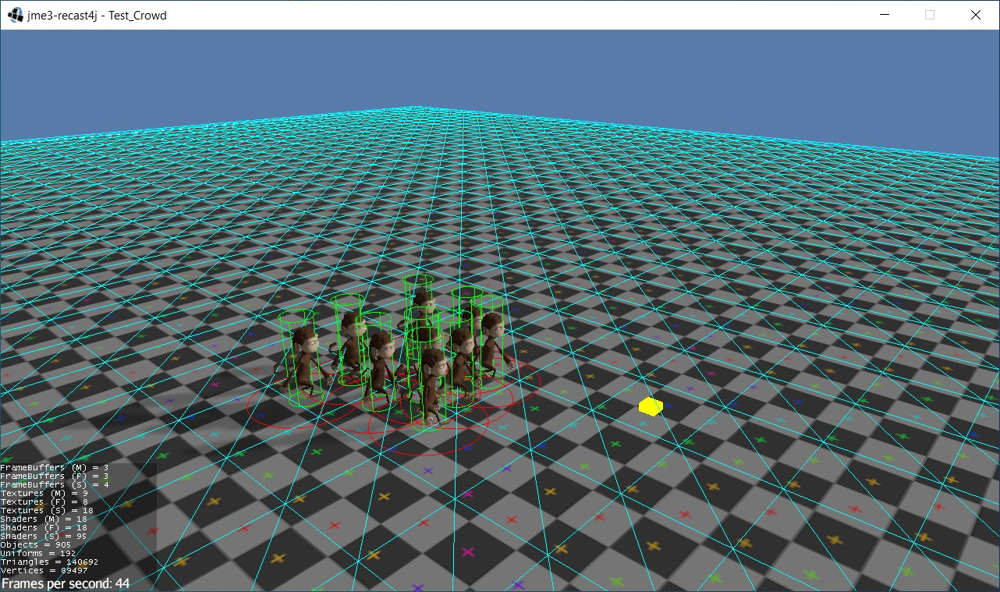
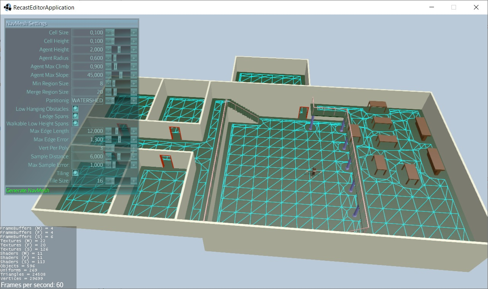
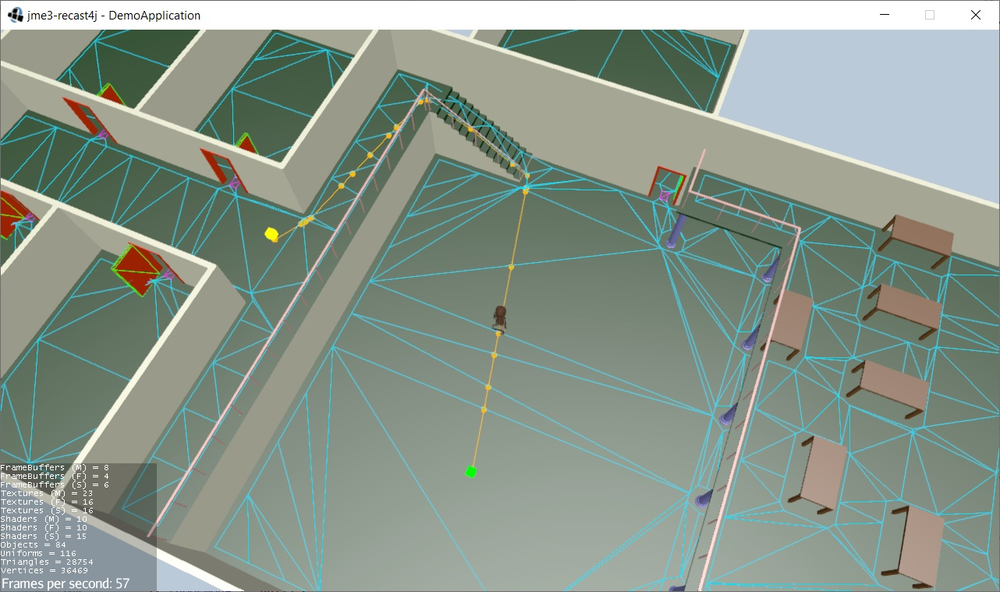
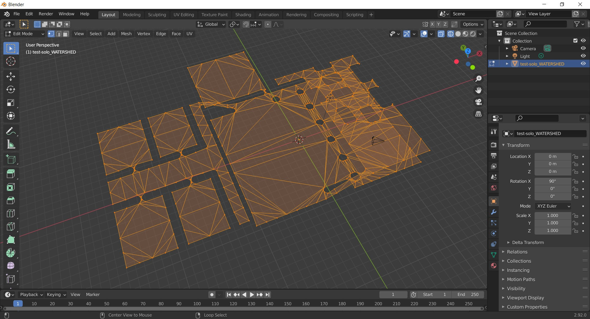

# jme-navmesh-ai
This project was born with the aim of creating a bridge API between the recast4j library and jMonkeyEngine.

This project optimizes and adds new tools and features to the original project [jme3-recast4j](https://github.com/MeFisto94/jme3-recast4j-demo/wiki)

🔔 If you found this project useful, please let me know by leaving a like to motivate me to improve it. Thanks.

### Features
- _NavMeshAgent_ that allows you to move the character in the Scene using the NavMesh.
- _NavMeshQueryFilter_ - Specifies which areas to consider when searching the NavMesh.
- _NavMeshTools_ - Use the NavMesh class to perform spatial queries such as pathfinding and walkability tests.
- _NavMeshBuildMarkup_ allows you to control how certain objects are treated during the NavMesh build process, specifically when collecting sources for building.
- _NavMeshBuildSettings_ allows you to specify a collection of settings which describe the dimensions and limitations of a particular agent type.
- _IORecast_ to export **NavMesh** in _.obj_ format.
- _Graphic Editor_ to modify the NavMesh generation parameters at Runtime.

# Requirements
The individual projects and their respective requirements used in this demo can be found by following these links.

- [jmonkeyengine](https://github.com/jMonkeyEngine/jmonkeyengine) - A complete 3D game development suite written purely in Java.
- [Minie](https://github.com/stephengold/Minie) - A physics library for JMonkeyEngine.
- [recast4j](https://github.com/ppiastucki/recast4j) - Java Port of Recast & Detour navigation mesh toolset.
- [Lemur](https://github.com/jMonkeyEngine-Contributions/Lemur) - jMonkeyEngine-based UI toolkit.
- java 11+

# Documentation
- [Recast Navigation for JME](https://wiki.jmonkeyengine.org/docs/3.4/contributions/ai/recast.html)
- [Building Process Slides](https://github.com/capdevon/jme3-recast4j-test-1/blob/main/docs/MikkoMononen_RecastSlides.pdf) - A series of slides that explain the build process of Recast.

# Youtube videos
[Demo Navigation-mesh](https://www.youtube.com/watch?v=XVWxy30IH7Q)

[NavMesh, Pathfinding Agents, Box and Circle Formation](https://www.youtube.com/watch?v=8J28kepYdsU)

# 
Crowd Agent WIP

⭐NEW Editor

Solo NavMesh

IORecast export .obj

# Credits
Huge thanks to MeFisto94 ad mitm001 for writing the original project this is based on.

## Bug report / feature request
The best way to report bug or feature request is [github's issues page](https://github.com/capdevon/jme-navmesh-ai/issues).
