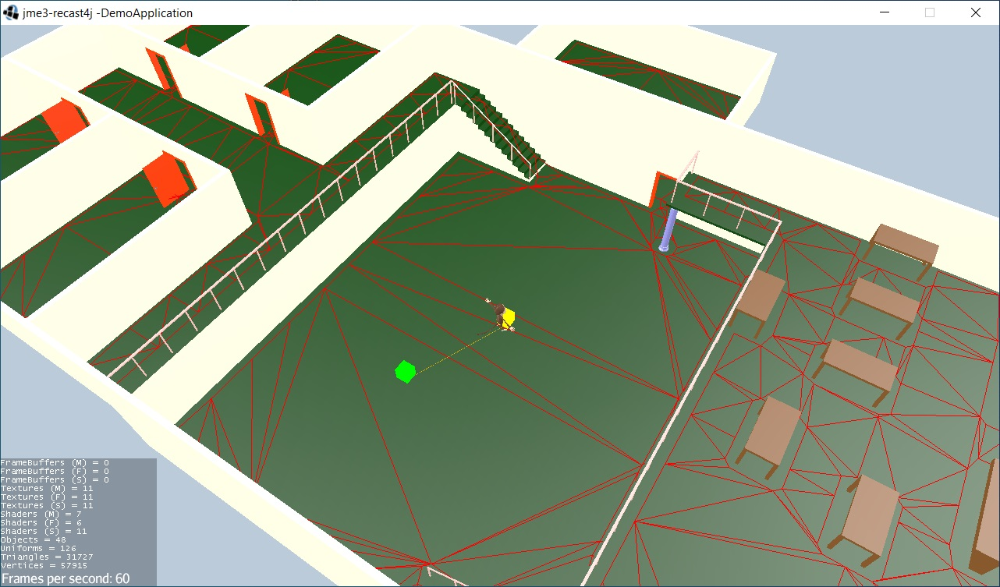
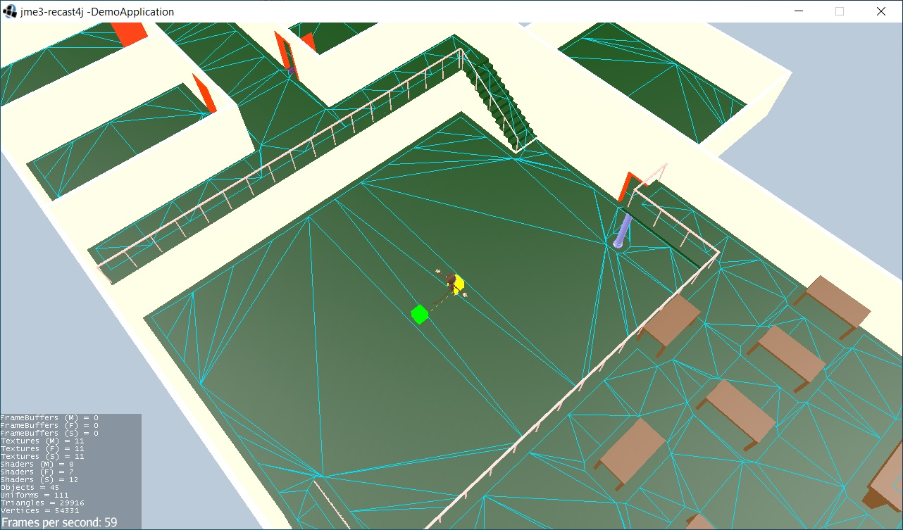
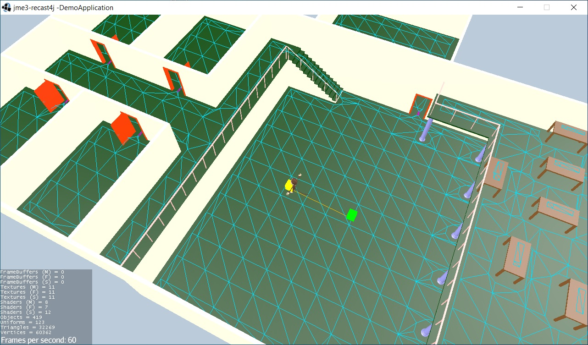

# jme3-recast4j-test-1
This project is the union of projects **jme3-recast4j** and **jme-recast4j-demo**. It contains a number of useful classes that show how to use the **recast4j** library with jMonkeyEngine3.

# Requirements:
The individual projects and their respective requirements used in this demo can be found by following these links.

- [jmonkeyengine](https://github.com/jMonkeyEngine/jmonkeyengine) - A complete 3D game development suite written purely in Java.
- [recast4j](https://github.com/ppiastucki/recast4j) - Java Port of Recast & Detour navigation mesh toolset.
- [Lemur](https://github.com/jMonkeyEngine-Contributions/Lemur) - jMonkeyEngine-based UI toolkit.

The gradle dependencies are as follows.

Gradle
```
ext.jmeVersion = '3.4.0-stable'
ext.recast4jVersion = '1.2.8'

dependencies {
    // Engine
    implementation 'org.jmonkeyengine:jme3-core:' + jmeVersion
    implementation 'org.jmonkeyengine:jme3-desktop:' + jmeVersion
    implementation 'org.jmonkeyengine:jme3-effects:' + jmeVersion
    implementation 'org.jmonkeyengine:jme3-terrain:' + jmeVersion
    implementation 'org.jmonkeyengine:jme3-jbullet:' + jmeVersion
    runtimeOnly 'org.jmonkeyengine:jme3-lwjgl:' + jmeVersion
    runtimeOnly 'org.jmonkeyengine:jme3-jogg:' + jmeVersion
    runtimeOnly 'org.jmonkeyengine:jme3-plugins:' + jmeVersion
    
    // recast4j
    implementation 'org.recast4j:parent:' + recast4jVersion
    implementation 'org.recast4j:detour-tile-cache:' + recast4jVersion
    implementation 'org.recast4j:detour-crowd:' + recast4jVersion
    implementation 'org.recast4j:detour-extras:' + recast4jVersion
    implementation 'org.recast4j:recast:' + recast4jVersion
    implementation 'org.recast4j:detour:' + recast4jVersion
        
    // Lemur GUI and Groovy:
    implementation 'com.simsilica:lemur:1.15.0'
    implementation 'com.simsilica:lemur-props:1.1.1'
    implementation 'com.simsilica:lemur-proto:1.12.0'
    runtimeOnly 'org.codehaus.groovy:groovy-jsr223:3.0.8'
}
```

# Documentation:
- [jme3-recast4j](https://github.com/MeFisto94/jme3-recast4j-demo/wiki)
- [Recast Navigation for JME](https://wiki.jmonkeyengine.org/docs/3.4/contributions/ai/recast.html)

# Youtube videos:
[Tiled NavMesh](https://youtu.be/rCZWPvcwktQ)


# 
buildSolo

buildSoloModified

buildTileCache


